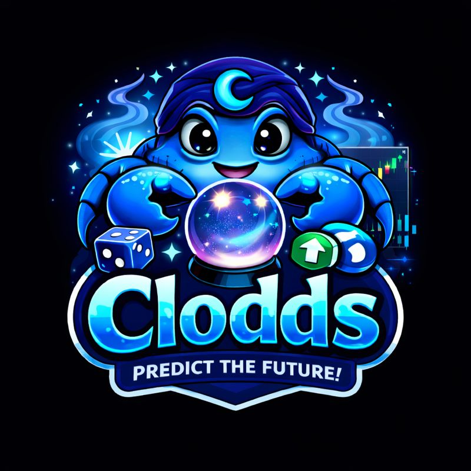

# Clodds

<p align="center">
  
</p>

<p align="center">
  A self-hosted AI trading workspace for prediction markets, crypto venues, and DeFi.
</p>

<p align="center">
  <a href="https://www.npmjs.com/package/clodds"></a>
  <a href="./LICENSE"></a>
  
</p>

Clodds brings market research, execution, automation, and risk controls into one interface. Run it locally, connect the venues you use, and interact through WebChat, the CLI, or a supported messaging channel.

The project is designed for operators who want to keep credentials and trading infrastructure under their own control. It can work as a read-only research assistant, a dry-run strategy lab, or an execution gateway when trading credentials are explicitly configured.

> [!WARNING]
> Clodds can submit real orders and interact with leveraged products. Start in dry-run mode, use dedicated low-balance accounts, and review every venue's legal, tax, and geographic restrictions. Nothing in this project is financial advice.

## Why Clodds

- **One workspace for fragmented markets.** Search, compare, monitor, and trade across prediction markets, centralized exchanges, and on-chain venues.
- **Chat-first operation.** Use the built-in WebChat, terminal, Telegram, Discord, Slack, and other channel adapters.
- **Provider choice.** Connect Claude, OpenAI, Gemini, Groq, Together, Fireworks, Bedrock, or a local Ollama model.
- **Automation with guardrails.** Run alerts, scheduled jobs, bots, backtests, and copy-trading flows behind configurable risk limits.
- **Self-hosted by default.** Store configuration and local state on your own machine and decide which external services to enable.
- **Extensible architecture.** Add venues, tools, skills, strategies, channels, and model providers without replacing the core gateway.

## What is included

| Area | Capabilities |
| --- | --- |
| Prediction markets | Market discovery, order books, portfolio tracking, execution adapters, arbitrage and opportunity scanning |
| Crypto trading | Spot and perpetual-futures connectors, position monitoring, funding data, TP/SL workflows |
| DeFi | Solana and EVM swaps, lending integrations, token tools, cross-chain transfers, MEV-aware execution paths |
| Research | Web and alternative-data tools, semantic memory, market comparison, edge and arbitrage analysis |
| Automation | Scheduled jobs, alerts, webhooks, trading bots, backtesting, signal routing |
| Risk and audit | Sizing controls, daily-loss limits, circuit breakers, kill switch, decision ledger and trade logs |
| Interfaces | WebChat, CLI, HTTP/WebSocket gateway, MCP server, messaging-channel adapters |

### Venue coverage

Availability depends on venue APIs, credentials, account eligibility, and regional restrictions.

| Category | Examples | Mode |
| --- | --- | --- |
| Prediction markets | Polymarket, Kalshi, Betfair, Smarkets, Drift, Opinion.xyz, Predict.fun | Data and execution, depending on venue |
| Forecasting/data | Manifold, Metaculus, PredictIt, AgentBets | Primarily read-only data |
| Perpetual futures | Binance, Bybit, Hyperliquid, MEXC, Drift, Percolator, Lighter | Data and execution |
| Solana | Jupiter, Raydium, Orca, Meteora, Kamino, MarginFi, Solend, Pump.fun, Bags.fm | Swaps, lending, launches, and market data |
| EVM | Uniswap V3, 1inch, PancakeSwap, Virtuals, Clanker, Veil | Swaps, token workflows, and market data |

See the [skills catalog](./docs/SKILLS_CATALOG.md) and [trading guide](./docs/TRADING.md) for connector-specific details.

## Quick start

### Requirements

- Node.js 22 or newer
- An API key for at least one supported model provider
- Optional venue or channel credentials for the integrations you enable

### Install from npm

```bash
npm install --global clodds
clodds onboard
```

The onboarding wizard creates the local configuration, helps connect a model provider, and starts the gateway. WebChat is then available at:

```text
http://localhost:18789/webchat
```

### Run from source

```bash
git clone https://github.com/rra7963/cloddsbot.git
cd cloddsbot
npm install
cp .env.example .env
npm run build
npm start
```

Add a model-provider key to `.env` before starting. Anthropic is the default provider:

```dotenv
ANTHROPIC_API_KEY=your_key_here
```

### Run with Docker

```bash
cp .env.example .env
docker compose up --build
```

Keep `.env`, private keys, exchange secrets, and local state out of version control.

## First-run checklist

1. Run `clodds onboard` and connect one model provider.
2. Open WebChat or start the terminal interface.
3. Confirm market-data queries work without trading credentials.
4. Enable dry-run mode and test the intended strategy.
5. Configure position, exposure, and daily-loss limits.
6. Add execution credentials only after reviewing the venue-specific guide.
7. Place a minimal test order before increasing size or enabling automation.

## Common commands

```bash
clodds onboard          # Interactive configuration
clodds start            # Start the gateway
clodds repl             # Open the terminal interface
clodds doctor           # Diagnose configuration and dependencies
clodds secure           # Review and harden the local setup
clodds mcp              # Start the MCP server
clodds mcp install      # Configure a supported MCP client
```

Inside chat, use `/help` to discover the commands available for the integrations you enabled.

## Interfaces

### WebChat

The built-in browser client provides persistent conversations, project organization, search, artifacts, code blocks, and long-context compaction. It uses the same gateway and tool permissions as the other interfaces.

### Messaging channels

Channel adapters include Telegram, Discord, Slack, WhatsApp, Teams, Matrix, Signal, iMessage, LINE, Nostr, Twitch, and others. Each adapter has its own setup requirements; enable only the channels you plan to operate.

### API and MCP

Clodds exposes an HTTP/WebSocket gateway for application integrations and an MCP server for compatible AI clients. Authentication and network binding matter in production—do not expose an unauthenticated gateway to the public internet.

## How it fits together

```text
WebChat / CLI / Channels / API clients
                  |
          Gateway and authentication
                  |
      Agent router, memory, and tools
                  |
    Strategy, automation, and risk layer
                  |
   Venue adapters and data integrations
                  |
 SQLite / LanceDB / optional PostgreSQL
```

The gateway normalizes user requests and routes them to agents and tools. Strategies and execution adapters share the risk layer, while local databases retain conversations, configuration, market state, and audit records.

For module-level details, see [Architecture](./docs/ARCHITECTURE.md).

## Configuration

Clodds reads environment variables and local configuration generated by the onboarding wizard. Start with [`.env.example`](./.env.example), which documents the optional model, channel, venue, database, and observability settings.

Local application data is stored under `~/.clodds/` unless you configure another path.

Useful references:

- [Quick start](./docs/QUICK_START.md)
- [User guide](./docs/USER_GUIDE.md)
- [Authentication](./docs/AUTHENTICATION.md)
- [Deployment guide](./docs/DEPLOYMENT_GUIDE.md)
- [Risk management](./docs/RISK_MANAGEMENT.md)
- [API reference](./docs/API_REFERENCE.md)
- [Skills catalog](./docs/SKILLS_CATALOG.md)

## Safety model

Clodds includes encrypted credential storage, approval gates for sensitive tools, audit logging, risk checks, and kill-switch controls. These features reduce operational risk; they do not eliminate it.

Before enabling live execution:

- use separate accounts and wallets with limited balances;
- set venue-level API permissions to the minimum required;
- disable withdrawals on exchange API keys when possible;
- keep the gateway private or place it behind authenticated TLS;
- configure loss, exposure, leverage, and slippage limits;
- back up local state without copying plaintext secrets;
- monitor unattended jobs and test emergency shutdown procedures.

Read [SECURITY.md](./SECURITY.md) for vulnerability reporting and [VPS security](./docs/VPS_SECURITY.md) before an internet-facing deployment.

## Development

```bash
npm install
npm run dev
npm run typecheck
npm test
npm run build
```

Contributions are welcome. Please read [CONTRIBUTING.md](./CONTRIBUTING.md) before opening a pull request and keep new integrations isolated behind clear configuration and safety defaults.

## Project status

Clodds integrates many third-party APIs and protocols. Connectors may change, become unavailable, or require updates without notice. Treat the compatibility tables as implementation coverage—not a guarantee that every service is available in every region or account.

## License

Clodds is available under the [MIT License](./LICENSE).
